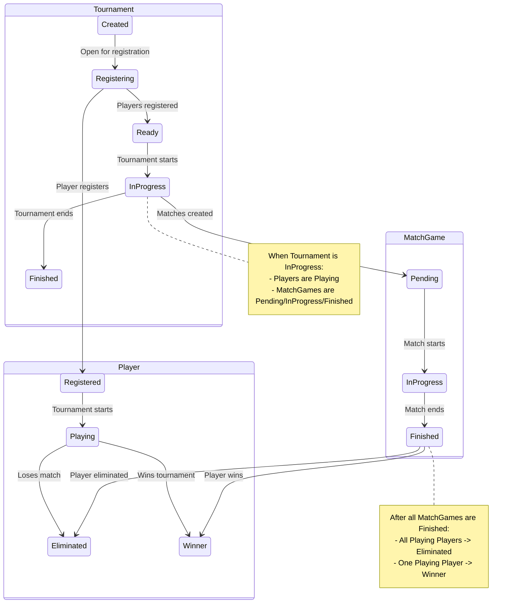

# Tournament Manager

This project implements a tournament management system using state machines 
to define and control the lifecycle of key entities: Tournaments, Players, and Match Games. 


## Installation

To set up the project locally, follow these steps:

1.  **Environment Configuration:**
    Copy the example environment file and configure your settings:
    ```bash
    cp .env.example .env
    ```
    Edit the `.env` file to set up your database connection and other environment variables.

2.  **Install Laravel Sail:**
    If you don't have Laravel Sail installed globally, you can install it via Composer:
    ```bash
    composer install
    ./vendor/bin/sail up -d
    ./vendor/bin/sail artisan migrate --seed
    ```

3.  **Install Pre-commit Hooks:**
    Run the following command to install the necessary Git pre-commit hooks, which help maintain code quality:
    ```bash
    php artisan install:pre-commit
    ```

## How to Play the game

### Simplest way

1.  **Create a Tournament**: A new tournament is created with basic details (name, gender, start date, players).
    -   API Endpoint: `POST /api/tournaments-sims`
    -   Expected State: `Finished`

A Postman Collection is provided here [collection.json](./postman_collection.json) 
so that you can see the payload required

Once the game is complete the tourament with all the matches and players as their end up in the competition,
the response will be the tournament results with all players and matchegames played.

### Full way

This section describes the full lifecycle of a tournament:
A Postman Collection is provided here [collection.json](./postman_collection.json) 

1.  **Create a Tournament**: A new tournament is created with basic details (name, gender, start date).
    -   API Endpoint: `POST /api/tournaments`
    -   Expected State: `Created`

2.  **Open for Registration**: The tournament transitions to the `Registering` state, allowing players to join.
    -   API Endpoint: `PATCH /api/tournaments/{tournament_id}` with `state: 'Registering'`
    -   Expected State: `Registering`

3.  **Register Players**: Players are added to the tournament. In the example, 4 players are registered.
    -   API Endpoint: `POST /api/tournaments/{tournament_id}/players`
    -   Verification: Tournament should have the correct number of registered players.

4.  **Move to Ready State**: The tournament transitions to `Ready`, indicating it has enough players and is set to begin.
    -   API Endpoint: `PATCH /api/tournaments/{tournament_id}` with `state: 'Ready'`
    -   Expected State: `Ready`
    -   Verification: Player registration is now closed (attempting to register more players should fail).

5.  **Start Tournament (In Progress) and Generate Matches**: The tournament moves to `In Progress`, and initial matches are automatically generated based on the registered players.
    -   API Endpoint: `PATCH /api/tournaments/{tournament_id}` with `state: 'In Progress'`
    -   Expected State: `In Progress`
    -   Verification: Matches are created (e.g., 4 players generate 2 matches).

6.  **Play and Finish Matches**: Each generated match progresses through its states (`In Progress` to `Finished`). As matches conclude, new matches (e.g., a final match) might be generated.
    -   API Endpoint: `PATCH /api/tournaments/{tournament_id}/match/{match_id}` with `state: 'In Progress'` then `state: 'Finished'` and `score`.
    -   Expected Match State: `In Progress` then `Finished`
    -   Verification: Players are eliminated, and the tournament's match count updates (e.g., 2 initial matches + 1 final match).

7.  **Transition Tournament to Finished**: Once all matches, including the final, are completed, the tournament transitions to `Finished`.
    -   API Endpoint: `PATCH /api/tournaments/{tournament_id}/match/{final_match_id}` with `state: 'In Progress'` then `state: 'Finished'` and `score`.
    -   Expected Tournament State: `Finished`
    -   Verification: Players are in their final states (`Eliminated` or `Winner`).


## Architecture

This project's architecture heavily relies on the **State Machine pattern**, 
The main reason for this is that all entities states relies on the state of at least one or more other entities.

Is a player is eliminated depends on the MatchGames and the evolution of the MatchGames changes the Tournament status.




to see more abount this state machine you can look at [StateMachine](./StateMachine.md)

The main benefit from this approach is that the entire system is divided in small discrete components (States and Transitions)

Adding new features will be adding or removing states or adding or removing transitions. 

In that way every new feature does not change the behaivor of the previous ones(there are some limitation on that of course). But follow the whole journey of an 
Entity is easy and stragth forward and every step of the way can be re tried if necesary.


