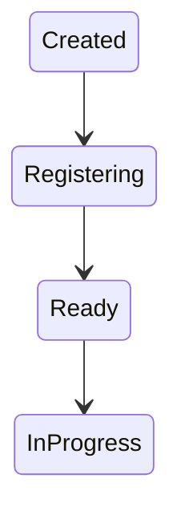
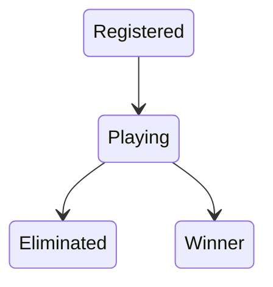
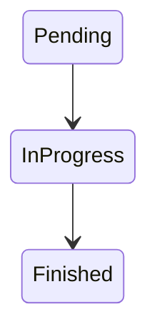
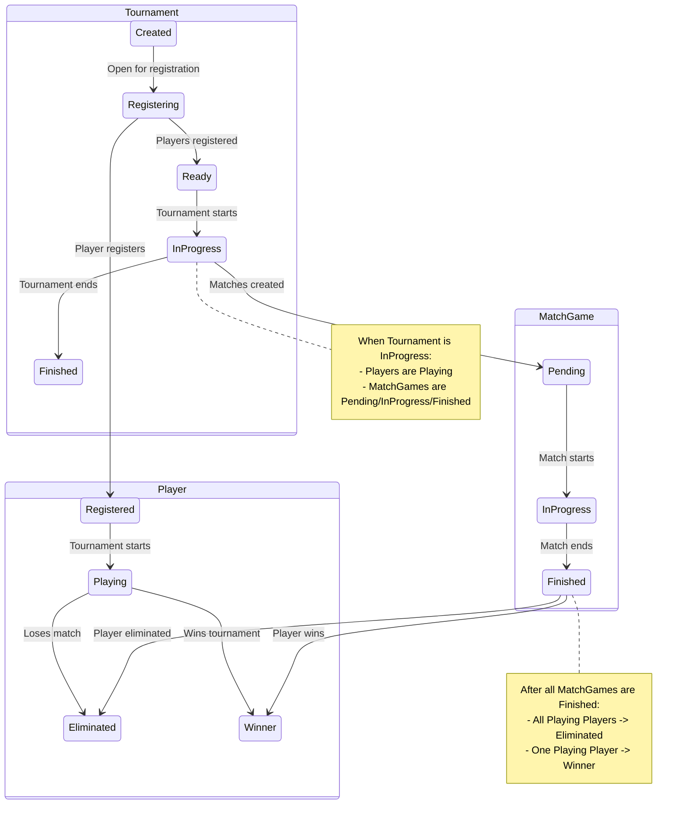

# State Machine Workflows

This document outlines the state machine workflows for `Tournament`, `Player`, and `MatchGame` entities within the system, including their individual transitions and interactions.

## Tournament Workflow

The `Tournament` entity follows a state machine to manage its lifecycle from creation to completion. The states represent different phases of a tournament, and transitions occur based on specific conditions or actions.

### States:
- `Created`: The initial state when a tournament is first created.
- `Registering`: Players can register for the tournament in this state.
- `Ready`: The tournament has enough registered players and is ready to start.
- `InProgress`: The tournament matches are actively being played.

### Transitions:
- `Created` -> `Registering`: Occurs when the tournament is opened for player registrations.
- `Registering` -> `Ready`: Occurs when the required number of players have registered, and the tournament is set to be ready.
- `Ready` -> `InProgress`: Occurs when the tournament officially starts, and matches begin.

## Player Workflow

The `Player` entity's state machine tracks a player's status within a tournament.

### States:
- `Registered`: The player has successfully registered for a tournament.
- `Playing`: The player is actively participating in matches within the tournament.
- `Eliminated`: The player has been knocked out of the tournament.
- `Winner`: The player has won the tournament.

### Transitions:
- `Registered` -> `Playing`: Occurs when the tournament starts and the player begins participating in matches.
- `Playing` -> `Eliminated`: Occurs when a player loses a match and is removed from the tournament.
- `Playing` -> `Winner`: Occurs when a player wins the final match of the tournament.

## MatchGame Workflow

The `MatchGame` entity represents individual matches within a tournament and progresses through states based on its play status.

### States:
- `Pending`: The match has been created but has not yet started.
- `InProgress`: The match is currently being played.
- `Finished`: The match has concluded, and a winner has been determined.

### Transitions:
- `Pending` -> `InProgress`: Occurs when the match officially begins.
- `InProgress` -> `Finished`: Occurs when the match ends.

## Combined Workflow: Tournament, Players, and MatchGames Interaction

This section describes the interaction between the `Tournament`, `Player`, and `MatchGame` state machines based on the example scenario:

1.  **Tournament Created**: A new tournament is in the `Created` state.
2.  **Transition to Registering**: The tournament transitions to `Registering`.
3.  **Players Register**: Players sign up, entering the `Registered` state.
4.  **Transition to Ready**: Once the required number of players have registered, the tournament transitions to `Ready`.
5.  **Transition to In Progress**: The tournament starts, moving to `In Progress`. At this point, `MatchGames` are generated in the `Pending` state, and all `Registered` players transition to `Playing`.
6.  **MatchGame In Progress**: Individual `MatchGames` transition from `Pending` to `In Progress` as they are played.
7.  **MatchGame Finished**: Upon completion, a `MatchGame` transitions to `Finished`. The losing player transitions from `Playing` to `Eliminated`. The winning player remains in `Playing` (unless it's the final match).
8.  **Tournament Finished**: When all `MatchGames` are `Finished`, the tournament transitions to `Finished`. The final winning player transitions to `Winner`, and all other `Playing` players transition to `Eliminated`.

