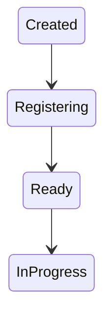
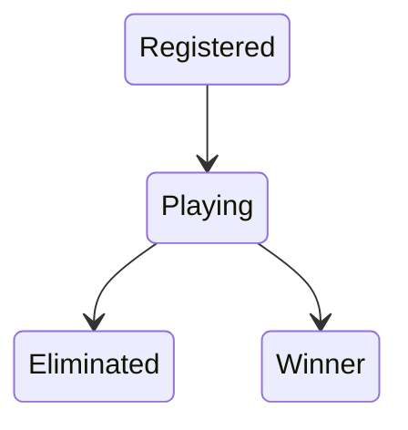
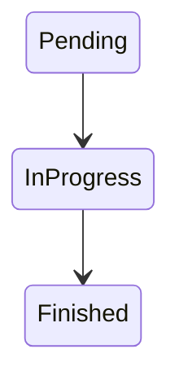
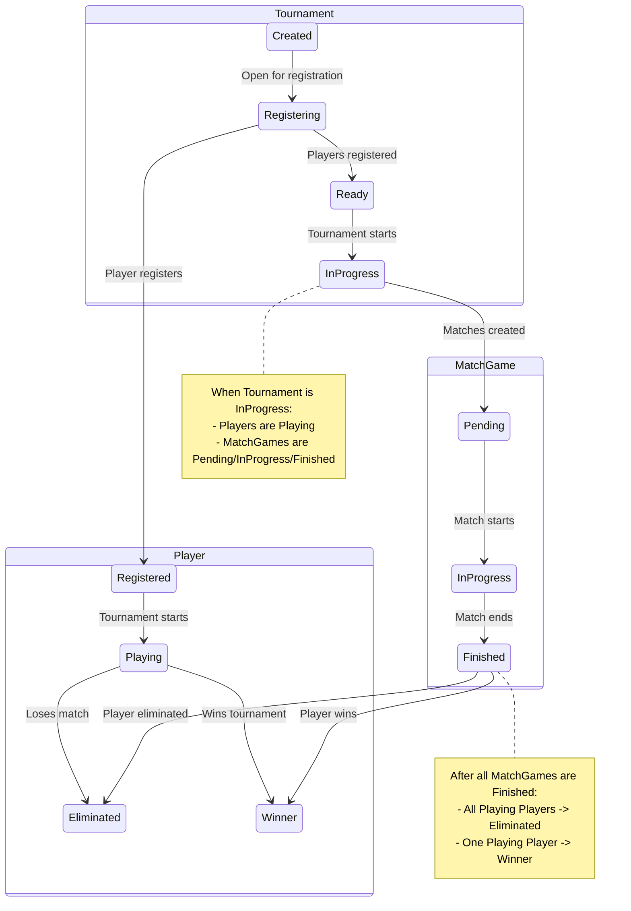

# State Machine Workflows

This document outlines the state machine workflows for `Tournament`, `Player`, and `MatchGame` entities within the system, including their individual transitions and interactions.

## Tournament Workflow

The `Tournament` entity follows a state machine to manage its lifecycle from creation to completion. The states represent different phases of a tournament, and transitions occur based on specific conditions or actions.

### States:
- `Created`: The initial state when a tournament is first created.
- `Registering`: Players can register for the tournament in this state.
- `Ready`: The tournament has enough registered players and is ready to start.
- `InProgress`: The tournament matches are actively being played.

### Transitions:
- `Created` -> `Registering`: Occurs when the tournament is opened for player registrations.
- `Registering` -> `Ready`: Occurs when the required number of players have registered, and the tournament is set to be ready.
- `Ready` -> `InProgress`: Occurs when the tournament officially starts, and matches begin.



## Player Workflow

The `Player` entity's state machine tracks a player's status within a tournament.

### States:
- `Registered`: The player has successfully registered for a tournament.
- `Playing`: The player is actively participating in matches within the tournament.
- `Eliminated`: The player has been knocked out of the tournament.
- `Winner`: The player has won the tournament.

### Transitions:
- `Registered` -> `Playing`: Occurs when the tournament starts and the player begins participating in matches.
- `Playing` -> `Eliminated`: Occurs when a player loses a match and is removed from the tournament.
- `Playing` -> `Winner`: Occurs when a player wins the final match of the tournament.



## MatchGame Workflow

The `MatchGame` entity represents individual matches within a tournament and progresses through states based on its play status.

### States:
- `Pending`: The match has been created but has not yet started.
- `InProgress`: The match is currently being played.
- `Finished`: The match has concluded, and a winner has been determined.

### Transitions:
- `Pending` -> `InProgress`: Occurs when the match officially begins.
- `InProgress` -> `Finished`: Occurs when the match ends.



## Combined Workflow: Tournament, Players, and MatchGames Interaction

This section describes the interaction between the `Tournament`, `Player`, and `MatchGame` state machines based on the example scenario:

1.  **Tournament Creation and Registration:** A tournament is `Created` and then transitions to `Registering`. At this point, `Player` entities can register, moving to the `Registered` state.
2.  **Tournament Ready:** Once the required number of players have `Registered`, the `Tournament` transitions from `Registering` to `Ready`.
3.  **Tournament Start and Match Creation:** The `Tournament` then transitions from `Ready` to `InProgress`. Simultaneously, `MatchGame` entities are created in the `Pending` state, and all `Registered` players transition to the `Playing` state.
4.  **Match Progression:** Individual `MatchGame` entities move from `Pending` to `InProgress` as they are played, and finally to `Finished` upon completion.
5.  **Tournament Conclusion and Player Status Update:** As `MatchGame` entities `Finished`, players in the `Playing` state are either `Eliminated` (if they lose) or continue `Playing`. Once all matches are `Finished` and a tournament winner is determined, all remaining `Playing` players transition to `Eliminated`, except for one player who transitions to `Winner`.




```mermaid
graph TD
    subgraph Tournament
        T_Created[Created] --> T_Registering[Registering];
        T_Registering --> T_Ready[Ready];
        T_Ready --> T_InProgress[In Progress];
        T_InProgress --> T_Finished[Finished];
    end

    subgraph Player
        P_Registered[Registered] --> P_Playing[Playing];
        P_Playing --> P_Eliminated[Eliminated];
        P_Playing --> P_Winner[Winner];
    end

    subgraph MatchGame
        M_Pending[Pending] --> M_InProgress[In Progress];
        M_InProgress --> M_Finished[Finished];
    end

    %% Interactions
    T_Registering -- Players register --> P_Registered;
    T_Ready -- Tournament starts --> M_Pending;
    M_Pending -- Match starts --> M_InProgress;
    M_InProgress -- Match ends --> M_Finished;
    T_InProgress -- Match finished --> P_Playing;
    M_Finished -- Player loses --> P_Eliminated;
    M_Finished -- Player wins --> P_Playing; %% Player continues playing if not final match
    T_InProgress -- All matches finished --> T_Finished;
    T_Finished -- Tournament winner --> P_Winner;
    T_Finished -- Other players --> P_Eliminated;
```
